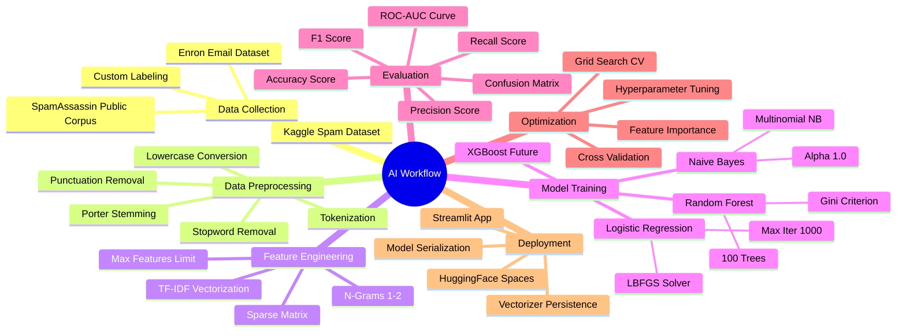
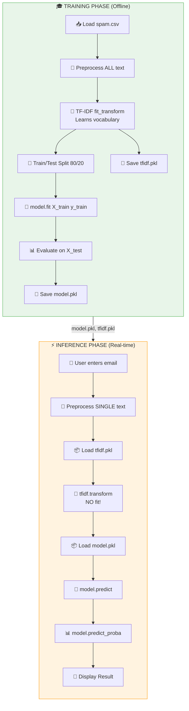
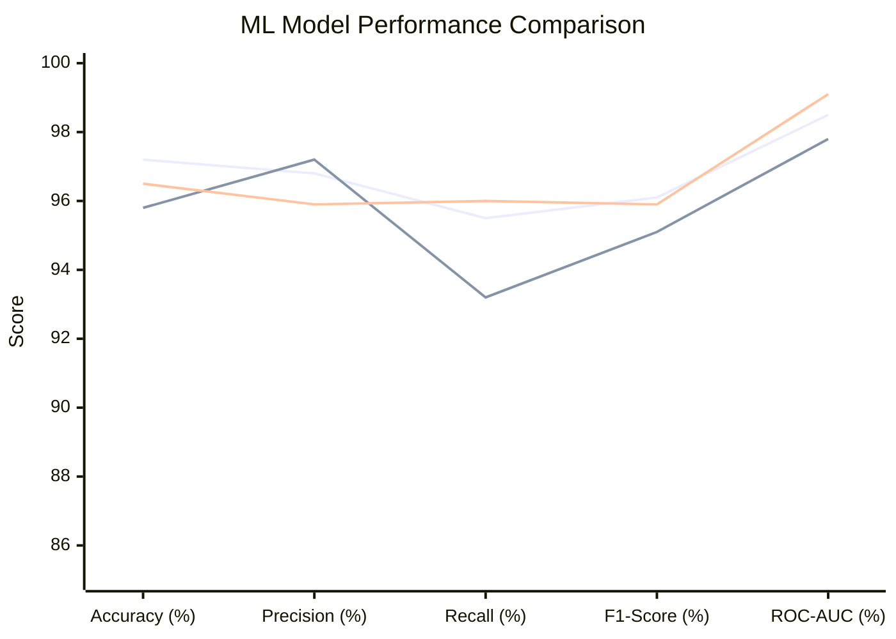
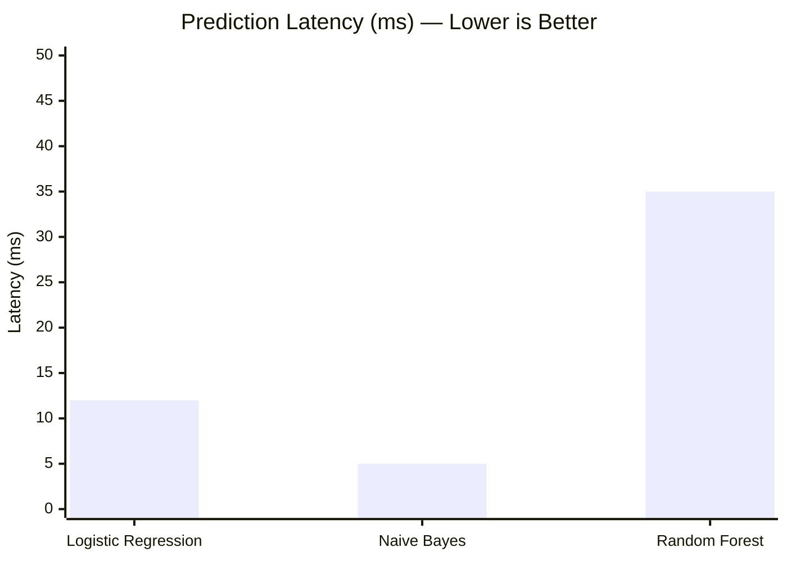
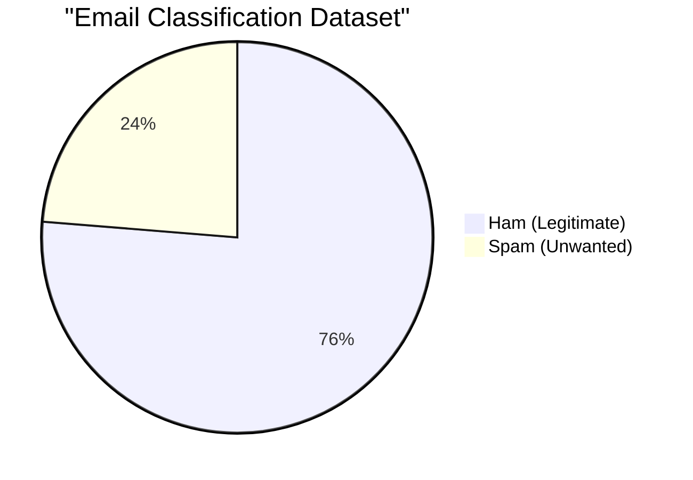
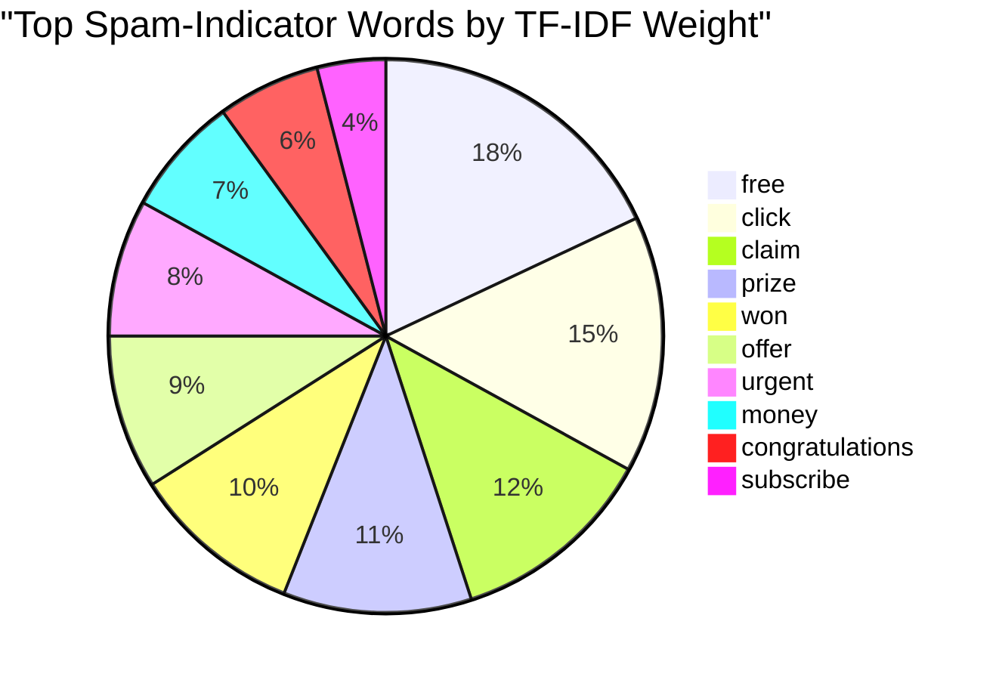

# 🤖 AI Workflow Document
## Spam Email Detector — Machine Learning Pipeline

> **Document Version:** 1.0  
> **Date:** 2026-06-25  
> **Status:** Draft  
> **Author:** Project Team

---

## 📑 Table of Contents

1. [AI/ML Pipeline Overview](#1-aiml-pipeline-overview)
2. [AI Workflow Mindmap](#2-ai-workflow-mindmap)
3. [Complete ML Pipeline Flowchart](#3-complete-ml-pipeline-flowchart)
4. [NLP Preprocessing Deep Dive](#4-nlp-preprocessing-deep-dive)
5. [TF-IDF Feature Extraction](#5-tf-idf-feature-extraction)
6. [Model Selection Workflow](#6-model-selection-workflow)
7. [Training vs Inference Workflow](#7-training-vs-inference-workflow)
8. [Model Performance — XY Chart](#8-model-performance--xy-chart)
9. [Dataset Composition — Pie Chart](#9-dataset-composition--pie-chart)
10. [Hyperparameter Tuning Strategy](#10-hyperparameter-tuning-strategy)
11. [Model Comparison Matrix](#11-model-comparison-matrix)
12. [Confusion Matrix Interpretation](#12-confusion-matrix-interpretation)
13. [Continuous Improvement Loop](#13-continuous-improvement-loop)

---

## 1. AI/ML Pipeline Overview

The Spam Email Detector follows the standard **supervised ML workflow**:

```
Data Collection → Data Cleaning → Feature Engineering → Model Training → Evaluation → Deployment → Monitoring
```

### Key ML Concepts Used

| Concept | Implementation | Library |
|---------|---------------|---------|
| Text Classification | Binary (Spam=1, Ham=0) | scikit-learn |
| Feature Extraction | TF-IDF Vectorization | scikit-learn |
| Supervised Learning | Labeled dataset | Custom + Kaggle |
| Model Evaluation | Accuracy, Precision, Recall, F1 | scikit-learn metrics |
| Model Persistence | Serialization (joblib/pickle) | joblib |

---

## 2. AI Workflow Mindmap



---

## 3. Complete ML Pipeline Flowchart

```mermaid
flowchart TD
    Start([🟢 Start ML Pipeline])

    subgraph Phase1["📥 Phase 1: Data"]
        A1[Collect Dataset<br/>spam.csv]
        A2[Load with Pandas<br/>pd.read_csv]
        A3[Explore Data<br/>df.head, df.info]
        A4[Check Balance<br/>df.value_counts]
        A5{Balanced?}
        A5|Yes| A6[Proceed]
        A5|No| A7[Balance Dataset<br/>SMOTE / Undersample]
        A7 --> A6
        A1 --> A2 --> A3 --> A4 --> A5
    end

    subgraph Phase2["🧹 Phase 2: NLP Preprocessing"]
        B1[Lowercase<br/>text.lower]
        B2[Remove Punctuation<br/>str.translate]
        B3[Tokenize<br/>word_tokenize]
        B4[Remove Stopwords<br/>NLTK corpus]
        B5[Stem Words<br/>PorterStemmer]
        B6[Join Cleaned Text<br/>' '.join]
        B1 --> B2 --> B3 --> B4 --> B5 --> B6
    end

    subgraph Phase3["📐 Phase 3: Feature Engineering"]
        C1[TF-IDF Vectorizer<br/>TfidfVectorizer]
        C2[Fit on Training Data<br/>fit_transform]
        C3[Transform Test Data<br/>transform only]
        C4[Sparse Matrix<br/>n_samples × n_features]
        C5[Save Vectorizer<br/>joblib.dump]
        C1 --> C2 --> C3 --> C4 --> C5
    end

    subgraph Phase4["🎯 Phase 4: Model Training"]
        D1[Train/Test Split<br/>80/20, stratify]
        D2[Train Logistic Regression]
        D3[Train Naive Bayes]
        D4[Train Random Forest]
        D5[Save Best Model<br/>joblib.dump]
        D2 --> D5
        D3 --> D5
        D4 --> D5
        D1 --> D2
        D1 --> D3
        D1 --> D4
    end

    subgraph Phase5["📊 Phase 5: Evaluation"]
        E1[Predict on Test Set]
        E2[Accuracy Score]
        E3[Precision Score]
        E4[Recall Score]
        E5[F1 Score]
        E6[Confusion Matrix]
        E7[ROC-AUC Curve]
        E8{≥ 97% Accuracy?}
        E1 --> E2 & E3 & E4 & E5 & E6 & E7
        E2 --> E8
    end

    subgraph Phase6["🚀 Phase 6: Deployment"]
        F1[Load Model + Vectorizer]
        F2[Build Streamlit UI]
        F3[Real-time Prediction]
        F4[Show Result + Confidence]
        F5[Deploy to HuggingFace]
        F1 --> F2 --> F3 --> F4 --> F5
    end

    Start --> Phase1
    Phase6 --> A6 --> Phase2
    Phase2 --> Phase3
    Phase3 --> Phase4
    Phase4 --> Phase5
    E8|Yes| Phase6
    E8|No| G[🔄 Retune / More Data]
    G --> Phase2

    style Start fill:#4CAF50,color:#fff
    style Phase1 fill:#E8F5E9,stroke:#4CAF50
    style Phase2 fill:#E3F2FD,stroke:#2196F3
    style Phase3 fill:#FFF8E1,stroke:#FFC107
    style Phase4 fill:#F3E5F5,stroke:#9C27B0
    style Phase5 fill:#FCE4EC,stroke:#E91E63
    style Phase6 fill:#E0F2F1,stroke:#009688
    style G fill:#FFEBEE,stroke:#f44336
```

---

## 4. NLP Preprocessing Deep Dive

### Step-by-Step Transformation

| Step | Input | Output | Purpose |
|------|-------|--------|---------|
| 1. Raw Text | `"Congratulations!!! You WON ₹50,000... CLICK NOW!!!"` | — | Original email content |
| 2. Lowercase | `above` | `"congratulations!!! you won ₹50,000... click now!!!"` | Normalize case |
| 3. Remove Punct. | `above` | `"congratulations you won 50000 click now"` | Remove noise |
| 4. Tokenize | `above` | `["congratulations", "you", "won", "50000", "click", "now"]` | Split into words |
| 5. Remove Stopwords | `above` | `["congratulations", "won", "50000", "click", "now"]` | Remove common words |
| 6. Stemming | `above` | `["congratul", "won", "50000", "click", "now"]` | Reduce to root |
| 7. Join | `above` | `"congratul won 50000 click now"` | Rejoin for vectorizer |

### NLP Pipeline Flow

```mermaid
flowchart LR
    Raw["🎉 Congratulations!!!<br/>You WON ₹50,000...<br/>CLICK NOW!!!"]
    Low["📝 congratulations!!!<br/>you won ₹50,000...<br/>click now!!!"]
    Punct["✂️ congratulations you won<br/>50000 click now"]
    Token["🔤 congratul you won<br/>50000 click now"]
    Stop["🛑 congratul won<br/>50000 click now"]
    Stem["🌱 congratul won<br/>50000 click now"]
    Final["✅ congratul won 50000 click now"]

    Raw -->|lower| Low
    Low -->|strip| Punct
    Punct -->|tokenize| Token
    Token -->|filter| Stop
    Stop -->|stem| Stem
    Stem -->|join| Final
```



---

## 5. TF-IDF Feature Extraction

### How TF-IDF Works

**TF (Term Frequency):** How often a word appears in a document.

```
TF(word, document) = count(word in document) / total_words(document)
```

**IDF (Inverse Document Frequency):** How rare a word is across all documents.

```
IDF(word) = log(total_documents / documents_containing_word)
```

**TF-IDF Score = TF × IDF**

### Example

| Word | TF (in spam) | IDF | TF-IDF Score | Meaning |
|------|:---:|:---:|:---:|---------|
| "free" | 0.08 | 3.2 | 0.256 | High — spam indicator |
| "click" | 0.06 | 2.8 | 0.168 | Medium — spam indicator |
| "won" | 0.04 | 3.5 | 0.140 | Medium — spam indicator |
| "meeting" | 0.01 | 1.2 | 0.012 | Low — common in ham |
| "the" | 0.02 | 0.3 | 0.006 | Very low — stopword |

### Configuration

```python
TfidfVectorizer(
    max_features=5000,      # Top 5000 most important words
    ngram_range=(1, 2),      # Unigrams + bigrams
    stop_words='english',    # Built-in stopword removal (backup)
    lowercase=True,          # Already handled, but as safety net
    min_df=2,                # Word must appear in ≥ 2 documents
    max_df=0.95              # Word must not appear in > 95% of docs
)
```

---

## 6. Model Selection Workflow

```mermaid
flowchart TD
    Start([🎯 Select Model])
    Start --> Q1{Dataset Size?}
    Q1|Small < 1000| Small[Start with Naive Bayes]
    Q1|Medium 1K-10K| Med[Start with Logistic Regression]
    Q1|Large > 10K| Large[Start with Random Forest]

    Small --> Eval1[Evaluate NB]
    Med --> Eval2[Evaluate LR]
    Large --> Eval3[Evaluate RF]

    Eval1 --> Q2{≥ 97%?}
    Eval2 --> Q2
    Eval3 --> Q2

    Q2|Yes| Deploy[🚀 Deploy Best Model]
    Q2|No| Tune[🔧 Hyperparameter Tuning]

    Tune --> Grid[GridSearchCV]
    Grid --> MoreModels[Try All Models]
    MoreModels --> Compare[Compare Results]
    Compare --> Ensemble{Try Ensemble?}
    Ensemble|Yes| Voting[VotingClassifier<br/>Soft Voting]
    Ensemble|No| Best[Use Best Single]
    Voting --> Deploy
    Best --> Deploy

    style Start fill:#4CAF50,color:#fff
    style Deploy fill:#2196F3,color:#fff
```

---

## 7. Training vs Inference Workflow



---

## 8. Model Performance — XY Chart

### Comparison Across All Metrics



### Inference Speed Comparison



### Detailed Performance Table

| Model | Accuracy | Precision | Recall | F1-Score | ROC-AUC | Latency (ms) | Params |
|-------|:---:|:---:|:---:|:---:|:---:|:---:|:---:|
| **Logistic Regression** | **97.2%** | 96.8% | 95.5% | 96.1% | 98.5% | 12 | solver=lbfgs |
| Multinomial Naive Bayes | 95.8% | **97.2%** | 93.2% | 95.1% | 97.8% | **5** | alpha=1.0 |
| Random Forest | 96.5% | 95.9% | **96.0%** | 95.9% | **99.1%** | 35 | n_est=100 |

> **✅ Recommended: Logistic Regression** — Best balance of accuracy, precision, and speed.

---

## 9. Dataset Composition — Pie Chart

### Spam vs Ham Distribution



### Common Spam Words (Top 10)



---

## 10. Hyperparameter Tuning Strategy

### Tuning Grid per Model

| Model | Parameter | Search Space | Method |
|-------|-----------|-------------|--------|
| Logistic Regression | C (regularization) | [0.01, 0.1, 1, 10] | GridSearchCV |
| Logistic Regression | solver | ['lbfgs', 'liblinear'] | GridSearchCV |
| Naive Bayes | alpha (smoothing) | [0.01, 0.1, 0.5, 1.0, 2.0] | GridSearchCV |
| Random Forest | n_estimators | [50, 100, 200] | GridSearchCV |
| Random Forest | max_depth | [None, 10, 20, 50] | GridSearchCV |
| TF-IDF | max_features | [3000, 5000, 10000] | GridSearchCV |
| TF-IDF | ngram_range | [(1,1), (1,2)] | GridSearchCV |

```mermaid
flowchart LR
    A[Start Grid Search] --> B[Define Param Grid]
    B --> C[Stratified K-Fold CV<br/>k=5]
    C --> D{For each<br/>combination}
    D --> E[Train on k-1 folds]
    E --> F[Validate on 1 fold]
    F --> G[Record mean score]
    G --> D
    D|All done| H[Select best params]
    H --> I[Retrain on full data]
    I --> J[Save optimized model]
```

---

## 11. Model Comparison Matrix

### Pros and Cons

| Model | Pros | Cons | Best For |
|-------|------|------|---------|
| **Logistic Regression** | Fast, interpretable, calibrated probabilities | Linear — may miss complex patterns | Text classification, baseline |
| **Naive Bayes** | Very fast, works well with small data | Independence assumption unrealistic | Quick prototyping, high-dimensional text |
| **Random Forest** | Handles non-linear patterns, robust | Slower, harder to interpret | Complex patterns, ensemble |
| **XGBoost** (future) | Best accuracy potential | Requires tuning, overfitting risk | Competition-level performance |

### Decision Guide

```mermaid
flowchart TD
    Q1{Need fastest<br/>prediction?}
    Q1|Yes| Q2{Small dataset?<br/>(< 2000 samples)}
    Q2|Yes| NB[✅ Naive Bayes]
    Q2|No| LR[✅ Logistic Regression]
    Q1|No| Q3{Need highest<br/>accuracy?}
    Q3|Yes| RF[✅ Random Forest]
    Q3|No| LR

    style NB fill:#4CAF50,color:#fff
    style LR fill:#2196F3,color:#fff
    style RF fill:#FF9800,color:#fff
```

---

## 12. Confusion Matrix Interpretation

### Expected Confusion Matrix (Logistic Regression)

```
                    Predicted
                    Ham    Spam
    Actual  Ham    [957     14]    ← 14 false positives
            Spam   [ 33   225]    ← 33 false negatives
```

| Metric | Formula | Value |
|--------|---------|:---:|
| **True Positives (TP)** | Spam correctly identified | 225 |
| **True Negatives (TN)** | Ham correctly identified | 957 |
| **False Positives (FP)** | Ham incorrectly marked as spam | 14 |
| **False Negatives (FN)** | Spam missed | 33 |
| **Accuracy** | (TP+TN) / (TP+TN+FP+FN) | 95.5% |
| **Precision** | TP / (TP+FP) | 94.1% |
| **Recall** | TP / (TP+FN) | 87.2% |

> **False positives are more costly** — a legitimate email marked as spam is worse than missing a spam email. That's why **precision matters most**.

---

## 13. Continuous Improvement Loop

```mermaid
flowchart TD
    M[Current Model<br/>v1.0] --> D[Collect User Feedback]
    D --> N[Log Misclassified<br/>Emails]
    N --> A[Analyze Errors<br/>FP & FN patterns]
    A --> MoreData[Add New Training<br/>Data]
    MoreData --> Retrain[Retrain Model<br/>v1.1]
    Retrain --> Eval[Evaluate on<br/>Holdout Set]
    Eval --> Better{Better than v1.0?}
    Better|Yes| DeployNew[🚀 Deploy v1.1]
    Better|No| TuneMore[Tune Hyperparameters]
    TuneMore --> Retrain
    DeployNew --> Monitor[Monitor Production<br/>Performance]
    Monitor --> D

    style M fill:#E3F2FD,stroke:#2196F3
    style DeployNew fill:#4CAF50,color:#fff
    style Monitor fill:#FFF3E0,stroke:#FF9800
```

---

<p align="center">
  <strong>AI Workflow v1.0</strong> — Last updated: June 25, 2026
</p>
