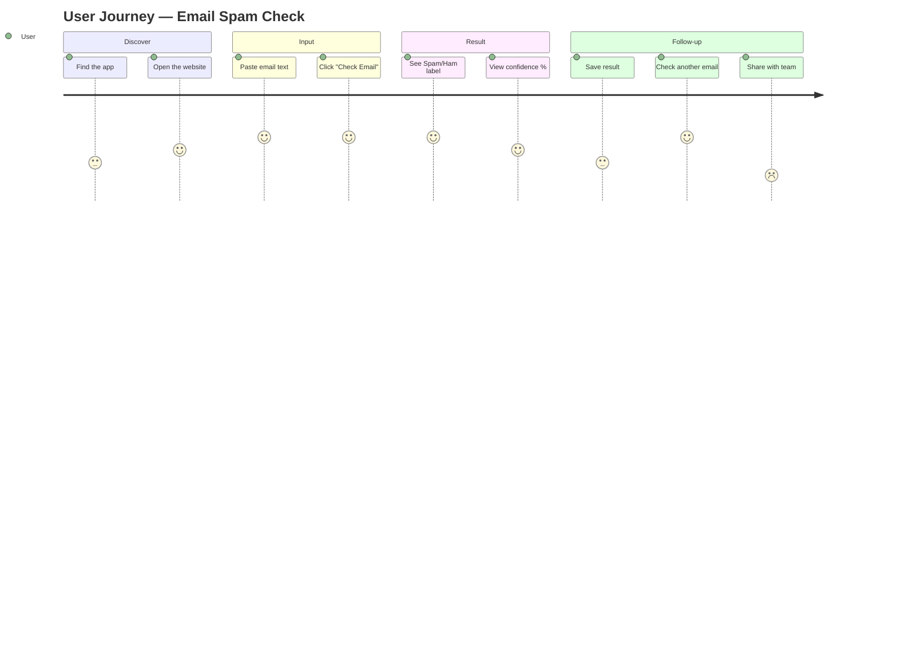
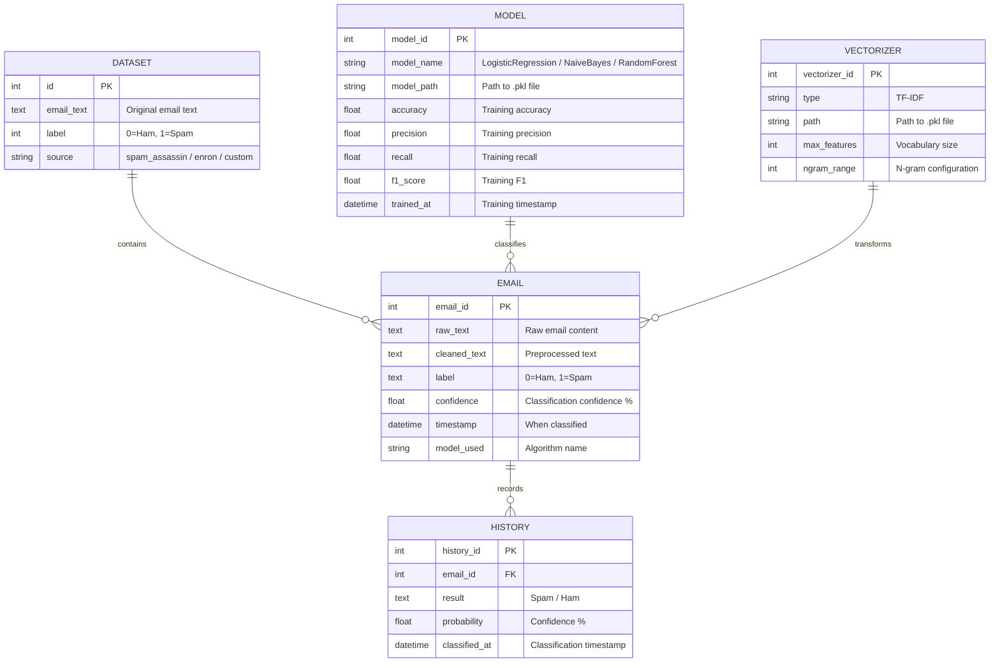
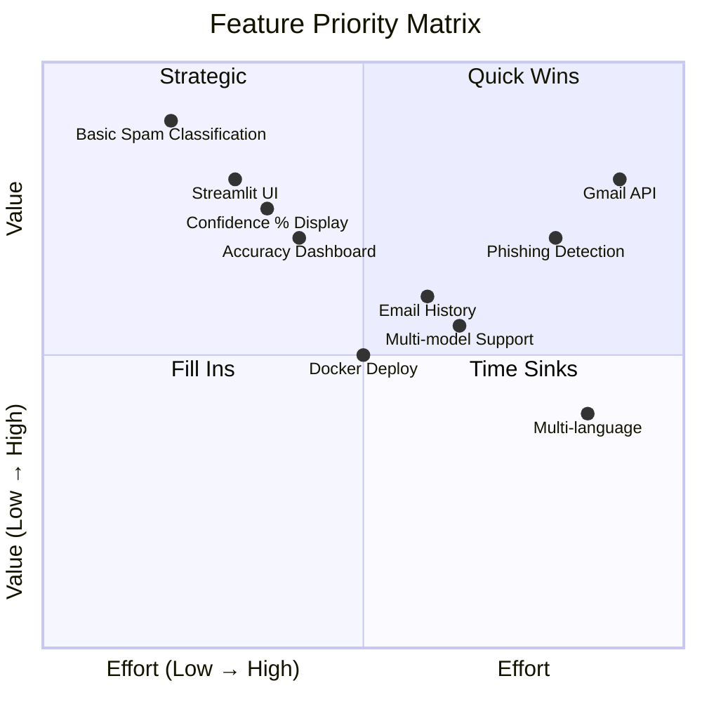
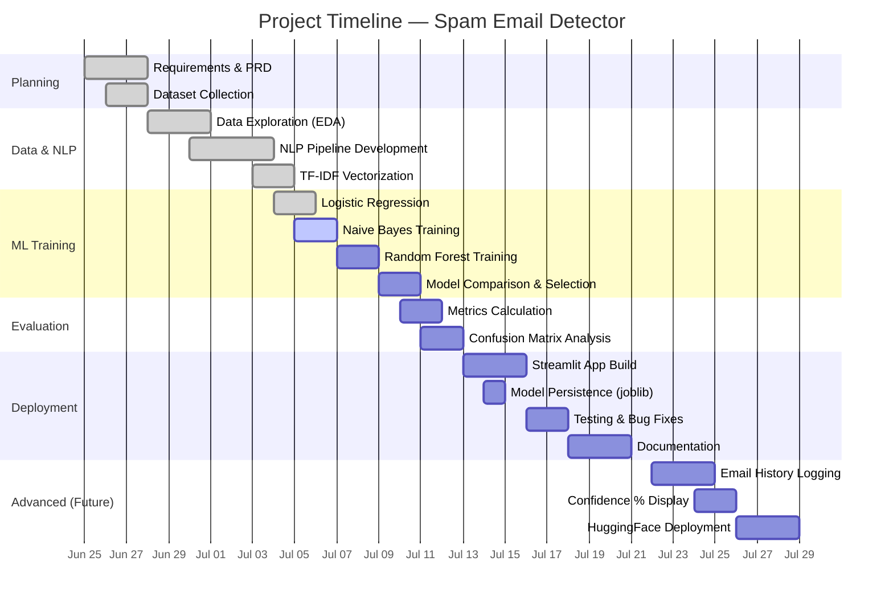
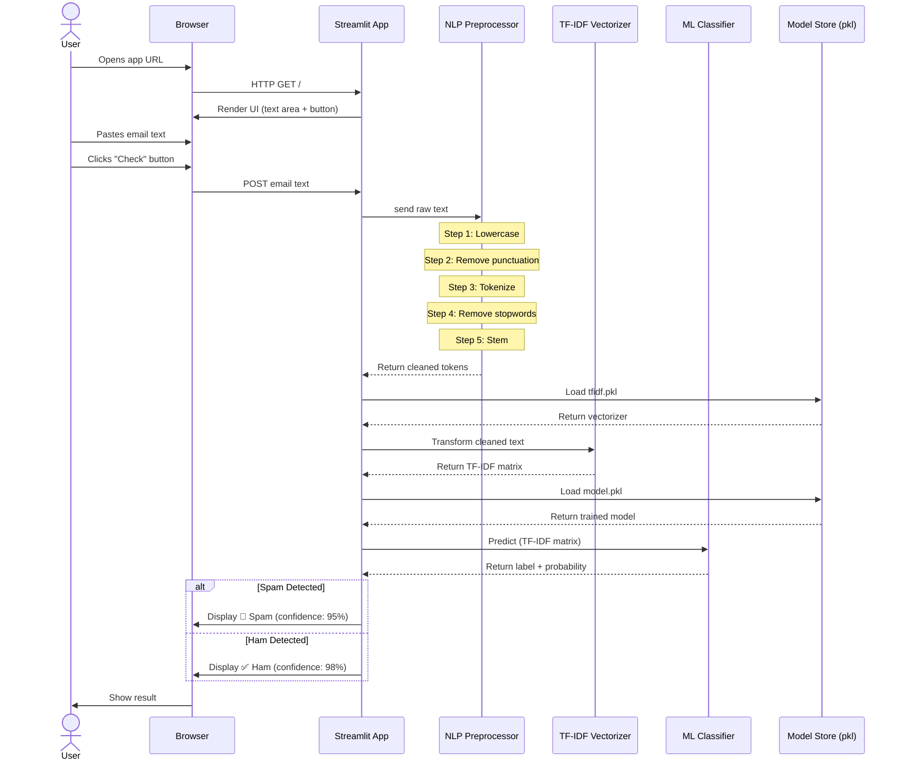
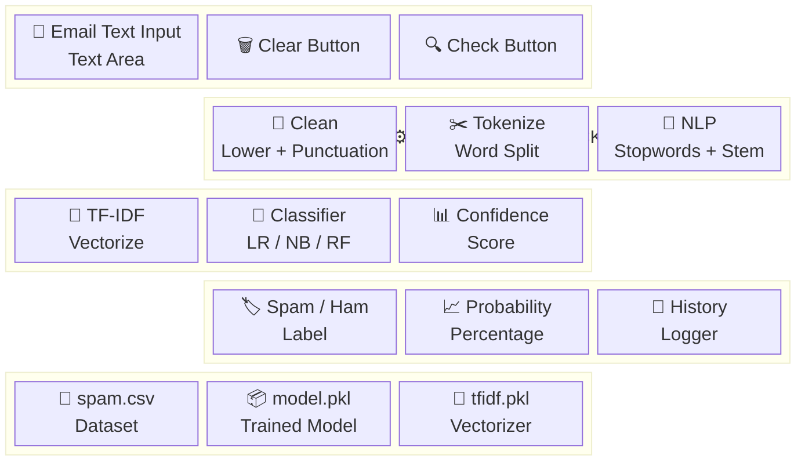

# 📄 Product Requirements Document (PRD)
## Spam Email Detector — NLP-Powered Classification

> **Document Version:** 1.0  
> **Date:** 2026-06-25  
> **Status:** Draft  
> **Author:** Project Team

---

## 📑 Table of Contents

1. [Executive Summary](#1-executive-summary)
2. [Problem Statement](#2-problem-statement)
3. [Product Vision](#3-product-vision)
4. [User Personas](#4-user-personas)
5. [User Journey Diagram](#5-user-journey-diagram)
6. [Functional Requirements](#6-functional-requirements)
7. [Non-Functional Requirements](#7-non-functional-requirements)
8. [Entity Relationship Diagram](#8-entity-relationship-diagram)
9. [Feature Breakdown](#9-feature-breakdown)
10. [Project Timeline — Gantt Chart](#10-project-timeline--gantt-chart)
11. [Sequence Diagram](#11-sequence-diagram)
12. [Block Diagram](#12-block-diagram)
13. [Success Metrics](#13-success-metrics)
14. [Risk Assessment](#14-risk-assessment)
15. [Out of Scope](#15-out-of-scope)

---

## 1. Executive Summary

**Spam Email Detector** is an AI-powered web application that classifies incoming emails as **Spam** (unwanted/promotional) or **Ham** (legitimate) using Natural Language Processing (NLP) and Machine Learning. The system provides real-time classification with a confidence score, helping users filter their inbox efficiently.

**Target accuracy:** ≥ 97%  
**Target response time:** < 1 second per classification  
**Deployment:** Streamlit web application

---

## 2. Problem Statement

| Problem | Impact | Solution |
|---------|--------|----------|
| Spam emails waste 3–5 hours/week per employee | Lost productivity | Automated instant classification |
| Manual filtering is error-prone | Missed legitimate emails | ML-based accurate detection |
| Phishing emails cause security breaches | Data theft, financial loss | NLP text analysis to flag threats |
| No free, open-source tool for quick email checking | Users rely on paid tools | Open-source Streamlit web app |

---

## 3. Product Vision

> *"An accessible, fast, and accurate spam detection tool that anyone can use — from individual email users to small businesses — to keep their inbox clean and safe."*

### Vision Statement
Build an end-to-end NLP text classification pipeline that:
- Processes raw email text in **under 1 second**
- Achieves **97%+ accuracy** across multiple ML models
- Provides an **interactive web UI** accessible to non-technical users
- Is **open-source and extensible** for community contributions

---

## 4. User Personas

### Persona 1 — Individual Email User
| Attribute | Detail |
|-----------|--------|
| **Name** | Priya Sharma |
| **Age** | 28 |
| **Role** | Professional receiving 50+ emails/day |
| **Pain Point** | Wastes time sorting spam from important emails |
| **Goal** | Quickly verify if a suspicious email is spam |
| **Tech Level** | Basic — uses web apps, not a developer |

### Persona 2 — Small Business Owner
| Attribute | Detail |
|-----------|--------|
| **Name** | Rahul Mehta |
| **Age** | 35 |
| **Role** | Runs a digital marketing agency |
| **Pain Point** | Phishing attacks targeting business email accounts |
| **Goal** | Protect business communications from spam & phishing |
| **Tech Level** | Intermediate — comfortable with SaaS tools |

### Persona 3 — ML Student / Developer
| Attribute | Detail |
|-----------|--------|
| **Name** | Alex Chen |
| **Age** | 22 |
| **Role** | Computer Science student |
| **Pain Point** | Needs a real-world NLP project for learning |
| **Goal** | Understand full ML pipeline from data to deployment |
| **Tech Level** | Advanced — Python, ML, Git |

---

## 5. User Journey Diagram

---

## 6. Functional Requirements

### FR-01: Email Text Input
| ID | Requirement | Priority | Acceptance Criteria |
|----|------------|----------|---------------------|
| FR-01.1 | Accept raw email text input | Must | Text area supports ≥ 10,000 characters |
| FR-01.2 | Support pasted email content | Must | User can paste directly from email client |
| FR-01.3 | Clear input button | Should | Single-click resets the text area |

### FR-02: NLP Text Preprocessing
| ID | Requirement | Priority | Acceptance Criteria |
|----|------------|----------|---------------------|
| FR-02.1 | Convert text to lowercase | Must | All uppercase chars converted |
| FR-02.2 | Remove punctuation | Must | All punctuation stripped |
| FR-02.3 | Tokenize text | Must | Text split into word tokens |
| FR-02.4 | Remove stopwords | Must | Common words (the, is, a) removed |
| FR-02.5 | Apply stemming | Must | Words reduced to root form |
| FR-02.6 | TF-IDF vectorization | Must | Text converted to numerical feature matrix |

### FR-03: ML Classification
| ID | Requirement | Priority | Acceptance Criteria |
|----|------------|----------|---------------------|
| FR-03.1 | Predict Spam/Ham | Must | Binary classification output |
| FR-03.2 | Show confidence score | Should | Probability percentage displayed |
| FR-03.3 | Support multiple models | Could | LR, Naive Bayes, Random Forest selectable |

### FR-04: Results Display
| ID | Requirement | Priority | Acceptance Criteria |
|----|------------|----------|---------------------|
| FR-04.1 | Visual Spam/Ham indicator | Must | Red for Spam, Green for Ham |
| FR-04.2 | Show probability % | Should | Percentage bar or numeric display |
| FR-04.3 | Display processing time | Could | Time taken shown in sidebar |

### FR-05: Model Training
| ID | Requirement | Priority | Acceptance Criteria |
|----|------------|----------|---------------------|
| FR-05.1 | Train from CSV dataset | Must | Support standard CSV with text+label columns |
| FR-05.2 | Save trained model | Must | Model serialized as .pkl file |
| FR-05.3 | Save TF-IDF vectorizer | Must | Vectorizer serialized for inference |
| FR-05.4 | Show training metrics | Should | Accuracy, precision, recall, F1 displayed |

### FR-06: Email History (Intermediate)
| ID | Requirement | Priority | Acceptance Criteria |
|----|------------|----------|---------------------|
| FR-06.1 | Log each classification | Should | Email text, result, timestamp saved |
| FR-06.2 | View history | Should | List of past classifications shown |
| FR-06.3 | Export history | Could | CSV export of history |

---

## 7. Non-Functional Requirements

| Category | Requirement | Target |
|----------|------------|--------|
| **Performance** | Classification time | < 1 second per email |
| **Performance** | App load time | < 3 seconds |
| **Accuracy** | Model accuracy | ≥ 97% |
| **Accuracy** | False positive rate | < 2% (legitimate emails marked as spam) |
| **Usability** | Learning curve | < 5 minutes for non-technical users |
| **Accessibility** | Browser support | Chrome, Firefox, Edge, Safari (latest 2 versions) |
| **Reliability** | Uptime | 99% during usage hours |
| **Security** | Data storage | No email content stored permanently (unless history enabled) |
| **Scalability** | Concurrent users | Support up to 50 simultaneous users |
| **Portability** | Deployment | Runs on any OS with Python 3.10+ |

---

## 8. Entity Relationship Diagram

---

## 9. Feature Breakdown

### Feature Priority Matrix

---

## 10. Project Timeline — Gantt Chart

---

## 11. Sequence Diagram

---

## 12. Block Diagram

---

## 13. Success Metrics

| Metric | Target | Measurement Method |
|--------|--------|--------------------|
| Model Accuracy | ≥ 97% | scikit-learn `accuracy_score` |
| Model Precision | ≥ 96% | `precision_score` (minimize false positives) |
| Model Recall | ≥ 95% | `recall_score` (catch most spam) |
| F1-Score | ≥ 96% | Harmonic mean of precision & recall |
| Classification Speed | < 1 second | End-to-end timing from click to result |
| App Load Time | < 3 seconds | Browser Network tab |
| User Satisfaction | ≥ 4/5 stars | In-app feedback form (future) |
| Code Coverage | ≥ 80% | pytest + coverage.py |

---

## 14. Risk Assessment

| Risk | Probability | Impact | Mitigation |
|------|------------|--------|------------|
| Low model accuracy on new data | Medium | High | Use cross-validation; retrain with more data |
| NLTK download failure | Low | Medium | Include offline fallback corpora |
| Large email text causes memory issues | Low | Low | Limit input to 10,000 characters |
| Streamlit app crashes under load | Low | Medium | Add error handling; test concurrent users |
| Overfitting to training dataset | Medium | High | Use train/test split; try regularization |
| Malicious input (XSS in emails) | Low | High | Sanitize all user input; escape HTML |

---

## 15. Out of Scope

The following features are **NOT** part of the initial release:

- ❌ Gmail / Outlook API integration (planned for v2.0)
- ❌ Multi-language spam detection (planned for v2.0)
- ❌ Phishing URL scanning (planned for v2.0)
- ❌ Real-time email monitoring / daemon
- ❌ Mobile native app (iOS/Android)
- ❌ User authentication / accounts
- ❌ Cloud deployment (AWS/GCP) — only local & HuggingFace Spaces

---

  <strong>PRD v1.0</strong> — Last updated: June 25, 2026

