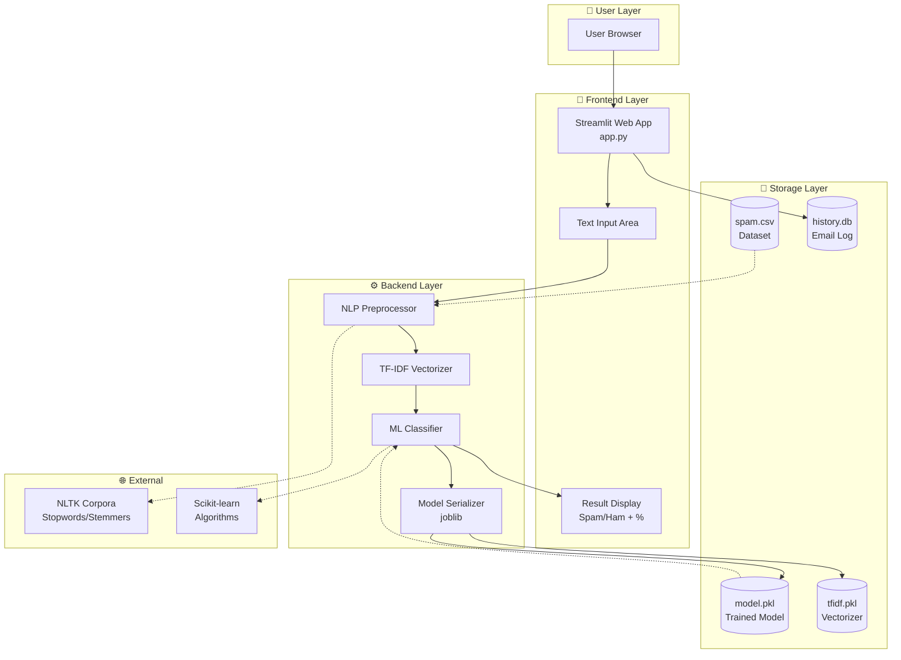
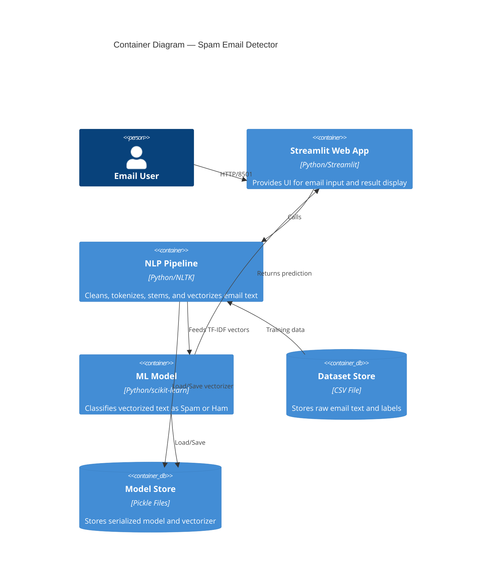
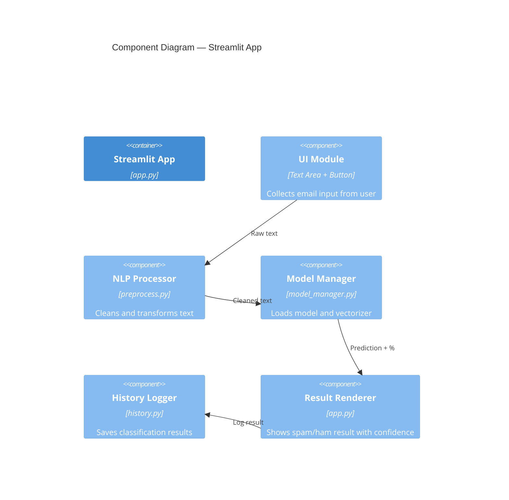
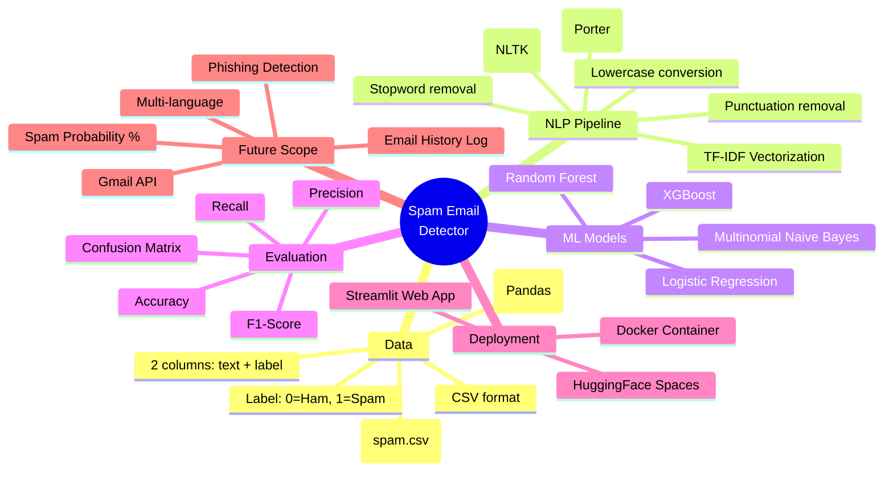
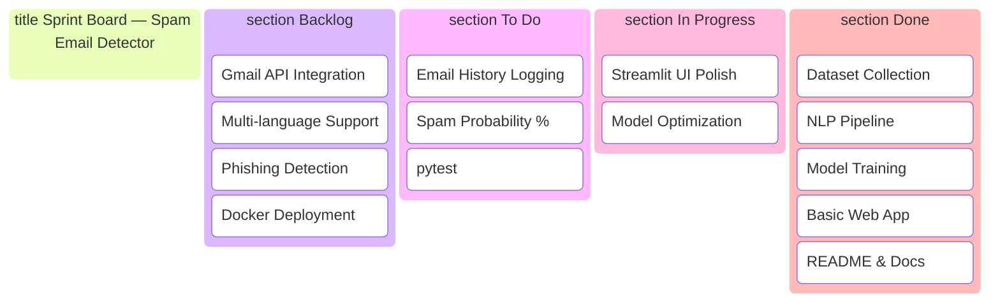
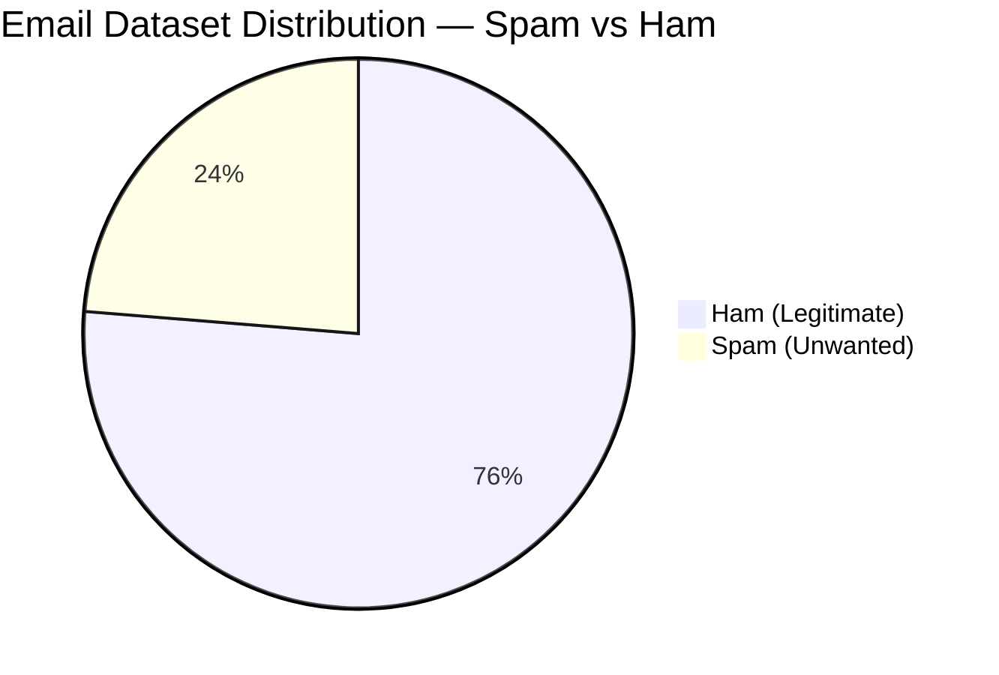

# 🎯 Spam Email Detector — NLP-Powered Email Classification

> **One-second AI-powered spam detection** — paste any email text and instantly know if it's **Spam** 🚨 or **Ham** ✅.

<p align="center">
  
  
  
  
  
</p>

---

## 📖 Table of Contents

- [Overview](#-overview)
- [Features](#-features)
- [Architecture Diagram](#-architecture-diagram)
- [C4 Model Diagrams](#-c4-model-diagrams)
- [Project Mindmap](#-project-mindmap)
- [Project Tree Structure](#-project-tree-structure)
- [Sprint Kanban](#-sprint-kanban)
- [Dataset Distribution](#-dataset-distribution)
- [Quick Start](#-quick-start)
- [Tech Stack](#-tech-stack)
- [Screenshots](#-screenshots)
- [Contributing](#-contributing)
- [License](#-license)

---

## 🧠 Overview

**Spam Email Detector** is an end-to-end machine learning application that classifies emails as **Spam** (unwanted/promotional) or **Ham** (legitimate) using Natural Language Processing (NLP) techniques. The project covers the full ML lifecycle — from data preprocessing to model training to interactive web deployment.

### What it does
| Input | Process | Output |
|-------|---------|--------|
| Raw email text | NLP pipeline (cleaning → tokenization → TF-IDF → ML model) | Spam 🚨 or Ham ✅ + confidence % |

---

## ⭐ Features

| Level | Feature | Status |
|-------|---------|--------|
| 🟢 Beginner | Real-time spam/ham classification | ✅ Done |
| 🟢 Beginner | Accuracy, precision, recall metrics | ✅ Done |
| 🟢 Beginner | Clean Streamlit UI | ✅ Done |
| 🟡 Intermediate | Spam probability percentage display | 🔄 Planned |
| 🟡 Intermediate | Email history logging | 🔄 Planned |
| 🔴 Advanced | Multi-language support | 📋 Future |
| 🔴 Advanced | Phishing email detection | 📋 Future |
| 🔴 Advanced | Gmail API integration | 📋 Future |

---

## 🏗️ Architecture Diagram

High-level system architecture showing how all components interact:



---

## 📐 C4 Model Diagrams

### Level 1 — System Context

```mermaid
C4Context
    title System Context — Spam Email Detector

    Person(user, "Email User", "Anyone who wants to check if an email is spam")

    System(spd, "Spam Email Detector", "NLP-powered web application that classifies emails as Spam or Ham")

    System_Ext(nltk, "NLTK Library", "Natural Language Toolkit for text processing")
    System_Ext(dataset, "Email Dataset", "CSV file containing labeled email samples")
    System_Ext(browser, "Web Browser", "User's browser to access Streamlit app")

    Rel(user, browser, "Uses")
    Rel(browser, spd, "Interacts via HTTP")
    Rel(spd, dataset, "Reads training data")
    Rel(spd, nltk, "Uses for NLP processing")

    UpdateLayoutConfig($topMargin: 80, $leftMargin: 150)
```

### Level 2 — Container



### Level 3 — Component



---

## 🗺️ Project Mindmap



---

## 🌳 Project Tree Structure

```mermaid
tree
  root[spam-detector]
    data
      spam.csv
      raw/
        spam_assassin.csv
        enron.csv
    models
      model.pkl
      tfidf.pkl
    notebooks
      01_eda.ipynb
      02_training.ipynb
      03_evaluation.ipynb
    src
      __init__.py
      preprocess.py
      train.py
      predict.py
      model_manager.py
      history.py
    app.py
    requirements.txt
    README.md
    PRD.md
    TRD.md
    AI_WORKFLOW.md
    USAGE.md
    .gitignore
    LICENSE
```

> **Expanded file listing:**

```
spam-detector/
├── 📂 data/
│   ├── spam.csv                    # Primary dataset
│   └── 📂 raw/                     # Raw downloaded datasets
│       ├── spam_assassin.csv
│       └── enron.csv
├── 📂 models/
│   ├── model.pkl                   # Serialized trained model
│   └── tfidf.pkl                   # Serialized TF-IDF vectorizer
├── 📂 notebooks/
│   ├── 01_eda.ipynb                # Exploratory Data Analysis
│   ├── 02_training.ipynb           # Model training experiments
│   └── 03_evaluation.ipynb         # Evaluation & comparison
├── 📂 src/
│   ├── __init__.py
│   ├── preprocess.py               # NLP cleaning pipeline
│   ├── train.py                    # Model training script
│   ├── predict.py                  # Prediction utilities
│   ├── model_manager.py            # Load/save model helpers
│   └── history.py                  # Email history logger
├── app.py                          # Streamlit web application
├── requirements.txt                # Python dependencies
├── README.md                       # Project overview
├── PRD.md                          # Product Requirements Document
├── TRD.md                          # Technical Requirements Document
├── AI_WORKFLOW.md                  # AI/ML workflow details
├── USAGE.md                        # Setup & usage guide
├── .gitignore                      # Git ignore rules
└── LICENSE                         # MIT License
```

---

## 📋 Sprint Kanban



---

## 📊 Dataset Distribution



---

## 🚀 Quick Start

```bash
# 1. Clone the repository
git clone https://github.com/yourusername/spam-detector.git
cd spam-detector

# 2. Create virtual environment
python -m venv venv
# Windows
venv\Scripts\activate
# macOS/Linux
source venv/bin/activate

# 3. Install dependencies
pip install -r requirements.txt

# 4. Download NLTK data
python -c "import nltk; nltk.download('stopwords'); nltk.download('punkt')"

# 5. Train the model
python src/train.py

# 6. Run the app
streamlit run app.py
```

> 📖 For detailed instructions, see [USAGE.md](./USAGE.md)

---

## 💻 Tech Stack

| Category | Technology | Purpose |
|----------|-----------|---------|
| Language | Python 3.10+ | Core development |
| Data | Pandas, NumPy | Data manipulation |
| NLP | NLTK, scikit-learn | Text processing & vectorization |
| ML | Logistic Regression, Naive Bayes, Random Forest | Classification |
| UI | Streamlit | Interactive web application |
| Serialization | joblib | Model persistence |
| Visualization | Matplotlib, Seaborn, WordCloud | EDA & charts |

---

## 📸 Screenshots

> *Add screenshots here after running the app:*

| Description | Image |
|-------------|-------|
| App Home Screen |  |
| Spam Detection Result |  |
| Ham Detection Result |  |

---

## 🤝 Contributing

Contributions are welcome! Please read [USAGE.md](./USAGE.md) for the complete contribution guide.

1. Fork the repository
2. Create a feature branch (`git checkout -b feature/my-feature`)
3. Commit your changes (`git commit -m 'Add feature'`)
4. Push to the branch (`git push origin feature/my-feature`)
5. Open a Pull Request

---

## 📄 License

This project is licensed under the **MIT License** — see the [LICENSE](./LICENSE) file for details.

---

<p align="center">
  Built with ❤️ using Python, NLP & Machine Learning
</p>
