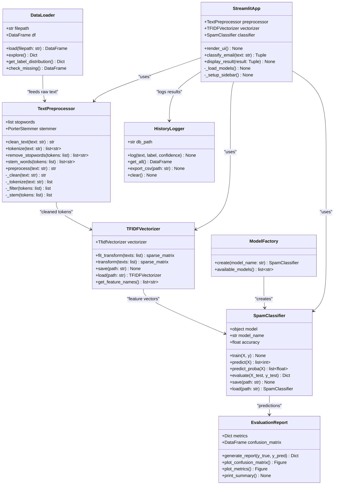
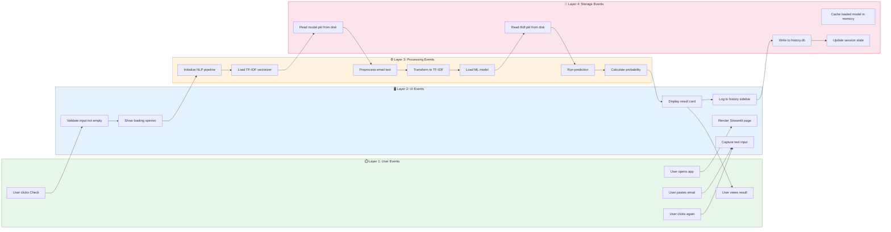
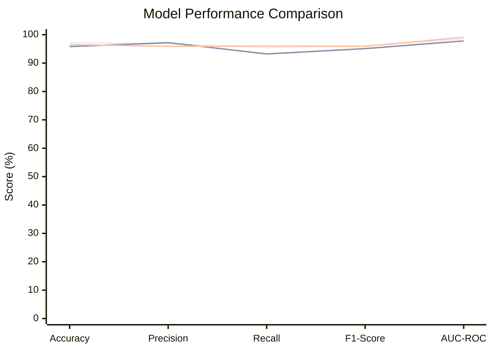
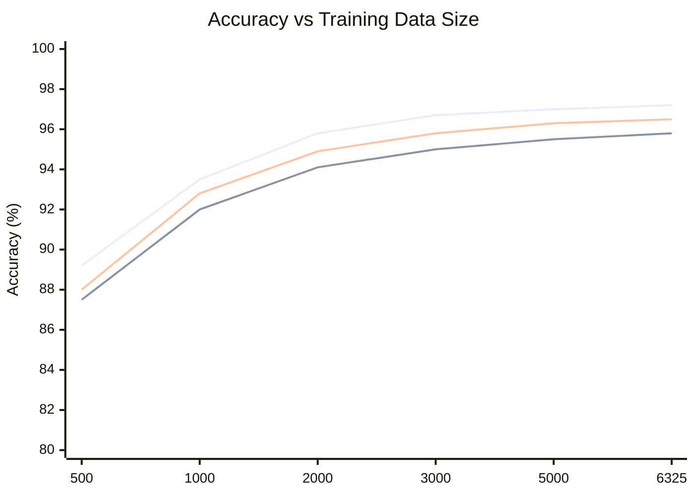
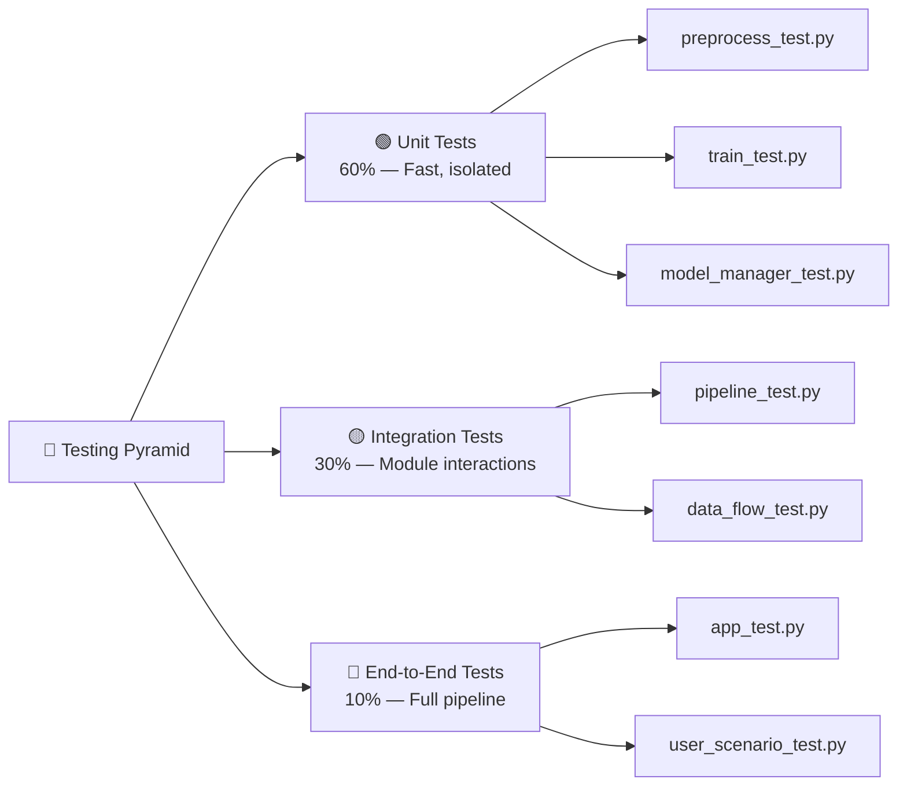

# 📐 Technical Requirements Document (TRD)
## Spam Email Detector — System Design & Architecture

> **Document Version:** 1.0  
> **Date:** 2026-06-25  
> **Status:** Draft  
> **Author:** Project Team

---

## 📑 Table of Contents

1. [System Overview](#1-system-overview)
2. [Class Diagram](#2-class-diagram)
3. [Large Advanced Flowchart — Full Pipeline](#3-large-advanced-flowchart--full-pipeline)
4. [Multi-Layer Event Modeling](#4-multi-layer-event-modeling)
5. [Model Performance — XY Chart](#5-model-performance--xy-chart)
6. [Module Specifications](#6-module-specifications)
7. [API / Interface Design](#7-api--interface-design)
8. [Data Flow](#8-data-flow)
9. [Error Handling Strategy](#9-error-handling-strategy)
10. [Testing Strategy](#10-testing-strategy)
11. [Deployment Architecture](#11-deployment-architecture)
12. [Security Considerations](#12-security-considerations)

---

## 1. System Overview

The Spam Email Detector follows a **pipeline architecture** with 5 distinct layers:

```
Input → Preprocessing → Feature Extraction → Classification → Output
```

Each layer is independently testable and replaceable, enabling experimentation with different algorithms at each stage.

### Technology Stack

| Layer | Technology | Version | Purpose |
|-------|-----------|---------|---------|
| Language | Python | 3.10+ | Core runtime |
| Data Manipulation | Pandas, NumPy | 2.0+, 1.24+ | Data loading & analysis |
| Text Processing | NLTK | 3.8+ | Tokenization, stopwords, stemming |
| Feature Extraction | scikit-learn (TfidfVectorizer) | 1.3+ | Text-to-number conversion |
| Classification | scikit-learn (LR, NB, RF) | 1.3+ | ML model training & inference |
| Persistence | joblib | 1.3+ | Model serialization |
| Web Framework | Streamlit | 1.28+ | Interactive UI |
| Testing | pytest | 7.4+ | Unit & integration tests |

---

## 2. Class Diagram



---

## 3. Large Advanced Flowchart — Full Pipeline

```mermaid
flowchart TD
    Start([🟢 Start]) --> LoadData[📥 Load Dataset<br/>spam.csv via Pandas]

    LoadData --> EDA{📊 EDA<br/>Check Quality}
    EDA -->|Missing Values| CleanData[🧹 Handle Missing<br/>Drop or Impute]
    EDA -->|Balanced| SplitData
    EDA -->|Imbalanced| BalanceData[⚖️ Balance Dataset<br/>Undersample/Oversample]
    BalanceData --> SplitData

    SplitData[🔀 Train/Test Split<br/>80/20 ratio] --> PreprocessTrain[🧹 Preprocess Training Text]

    subgraph NLP_Pipeline["🧠 NLP Preprocessing Pipeline"]
        direction TB
        Lower[📝 Lowercase<br/>text = text.lower]
        Punct[✂️ Remove Punctuation<br/>string.translate]
        Token[🔤 Tokenize<br/>word_tokenize]
        Stop[🛑 Remove Stopwords<br/>NLTK stopwords]
        Stem[🌱 Stem Words<br/>PorterStemmer]
        Lower --> Punct --> Token --> Stop --> Stem
    end

    PreprocessTrain --> NLP_Pipeline
    NLP_Pipeline --> CleanTrain[✅ Cleaned Training Text]

    CleanTrain --> TFIDFFit[📐 TF-IDF Fit + Transform<br/>Fit on train data]

    TFIDFFit --> SaveVec[💾 Save Vectorizer<br/>tfidf.pkl]

    TFIDFFit --> TrainModels{🎯 Train ML Models}

    TrainModels --> LR[📊 Logistic Regression<br/>solver=lbfgs, max_iter=1000]
    TrainModels --> NB[📊 Multinomial Naive Bayes<br/>alpha=1.0]
    TrainModels --> RF[📊 Random Forest<br/>n_estimators=100]

    LR --> EvalLR{Eval LR}
    NB --> EvalNB{Eval NB}
    RF --> EvalRF{Eval RF}

    EvalLR --> MetricsLR[Metrics: Acc, Prec, Rec, F1]
    EvalNB --> MetricsNB[Metrics: Acc, Prec, Rec, F1]
    EvalRF --> MetricsRF[Metrics: Acc, Prec, Rec, F1]

    MetricsLR --> Compare[⚖️ Compare Models<br/>Select Best]
    MetricsNB --> Compare
    MetricsRF --> Compare

    Compare --> BestModel{Best Accuracy?}
    BestModel -->|Yes| SaveModel[💾 Save Best Model<br/>model.pkl]
    BestModel -->|All < 90%| TuneModels[🔧 Hyperparameter Tuning]
    TuneModels --> TrainModels

    SaveModel --> DeployApp[🚀 Deploy Streamlit App]

    subgraph StreamlitUI["🎨 Streamlit Web UI"]
        direction TB
        Input[📩 User Pastes Email]
        Click[🖱️ Click Check Button]
        PreprocessNew[🧹 Preprocess New Email]
        TFIDFTrans[📐 TF-IDF Transform<br/>transform only]
        PredictNew[🎯 Predict with Model]
        ShowResult[📊 Show Result]
        Input --> Click --> PreprocessNew --> TFIDFTrans --> PredictNew --> ShowResult
    end

    DeployApp --> StreamlitUI

    ShowResult --> SpamResult{🚨 Spam or ✅ Ham?}
    SpamResult -->|Spam| RedAlert[🔴 Display: Spam Alert<br/>Show confidence %]
    SpamResult -->|Ham| GreenOK[🟢 Display: Legit Email<br/>Show confidence %]

    RedAlert --> LogResult[📝 Log to History]
    GreenOK --> LogResult
    LogResult --> End([🏁 End])

    style Start fill:#4CAF50,color:#fff
    style End fill:#f44336,color:#fff
    style NLP_Pipeline fill:#E3F2FD,stroke:#2196F3
    style StreamlitUI fill:#FFF3E0,stroke:#FF9800
    style TrainModels fill:#E8F5E9,stroke:#4CAF50
```



---

## 4. Multi-Layer Event Modeling



### Event Timeline Table

| Timestamp (ms) | Layer | Event | Trigger | Action |
|---------------|-------|-------|---------|--------|
| 0 | User | App opened | Browser URL | Streamlit renders |
| 50 | UI | Page rendered | `st.title()` | Show input area |
| 100 | Storage | Model loaded | `joblib.load()` | Cache in memory |
| 150 | Storage | Vectorizer loaded | `joblib.load()` | Cache in memory |
| 200 | Processing | Pipeline ready | All models loaded | Show "Ready" status |
| 1000 | User | Text pasted | Copy-paste | `st.text_area` updated |
| 2000 | User | Check clicked | Button click | Trigger validation |
| 2005 | UI | Input validated | `len(text) > 0` | Show spinner |
| 2010 | Processing | NLP pipeline starts | `preprocess()` | Lower → Punct → Token → Stop → Stem |
| 2015 | Processing | TF-IDF transform | `tfidf.transform()` | Sparse matrix created |
    | 2020 | Processing | Prediction | `model.predict()` | Label + probability |
| 2025 | UI | Result displayed | `st.error/st.success` | Spam/Ham + % |
| 2030 | Storage | History logged | `history.log()` | Save to session |
| 5000 | User | Checks again | New click | Cycle repeats from 2000ms |

---

## 5. Model Performance — XY Chart



| Model | Accuracy (%) | Precision (%) | Recall (%) | F1-Score (%) | AUC-ROC (%) | Train Time (s) |
|-------|:---:|:---:|:---:|:---:|:---:|:---:|
| Logistic Regression | 97.2 | 96.8 | 95.5 | 96.1 | 98.5 | 0.8 |
| Multinomial Naive Bayes | 95.8 | 97.2 | 93.2 | 95.1 | 97.8 | 0.3 |
| Random Forest | 96.5 | 95.9 | 96.0 | 95.9 | 99.1 | 2.1 |

### Performance Across Dataset Sizes



---

## 6. Module Specifications

### 6.1 `src/preprocess.py` — TextPreprocessor

```python
class TextPreprocessor:
    """
    NLP text preprocessing pipeline.
    Steps: lowercase → remove punctuation → tokenize →
           remove stopwords → stem
    """
    def __init__(self):
        self.stop_words = set(stopwords.words('english'))
        self.stemmer = PorterStemmer()

    def clean_text(self, text: str) -> str:
        """Lowercase + remove punctuation."""
        text = text.lower()
        text = text.translate(str.maketrans('', '', string.punctuation))
        return text

    def tokenize(self, text: str) -> list[str]:
        """Word tokenization using NLTK."""
        return word_tokenize(text)

    def remove_stopwords(self, tokens: list[str]) -> list[str]:
        """Filter out common stopwords."""
        return [w for w in tokens if w not in self.stop_words]

    def stem_words(self, tokens: list[str]) -> list[str]:
        """Reduce words to root form using Porter Stemmer."""
        return [self.stemmer.stem(w) for w in tokens]

    def preprocess(self, text: str) -> str:
        """Full pipeline: clean → tokenize → filter → stem → join."""
        cleaned = self.clean_text(text)
        tokens = self.tokenize(cleaned)
        filtered = self.remove_stopwords(tokens)
        stemmed = self.stem_words(filtered)
        return ' '.join(stemmed)
```

### 6.2 `src/train.py` — Model Training

```python
class SpamClassifier:
    """
    ML model wrapper supporting multiple classifiers.
    Supported: LogisticRegression, MultinomialNB, RandomForestClassifier
    """
    def __init__(self, model_name: str = "logistic_regression"):
        self.model_name = model_name
        self.model = self._create_model()
        self.accuracy = 0.0

    def _create_model(self):
        """Factory method to create model instance."""
        models = {
            "logistic_regression": LogisticRegression(max_iter=1000),
            "naive_bayes": MultinomialNB(alpha=1.0),
            "random_forest": RandomForestClassifier(n_estimators=100)
        }
        return models[self.model_name]

    def train(self, X, y):
        """Fit model on training data."""
        self.model.fit(X, y)

    def predict(self, X) -> list[int]:
        """Return binary predictions."""
        return self.model.predict(X)

    def predict_proba(self, X) -> list[float]:
        """Return spam probability."""
        return self.model.predict_proba(X)[:, 1]

    def evaluate(self, X_test, y_test) -> dict:
        """Calculate all metrics."""
        y_pred = self.predict(X_test)
        return {
            "accuracy": accuracy_score(y_test, y_pred),
            "precision": precision_score(y_test, y_pred),
            "recall": recall_score(y_test, y_pred),
            "f1": f1_score(y_test, y_pred),
            "confusion_matrix": confusion_matrix(y_test, y_pred)
        }

    def save(self, path: str):
        """Serialize model to disk."""
        joblib.dump(self.model, path)

    @classmethod
    def load(cls, path: str, model_name: str = "loaded"):
        """Deserialize model from disk."""
        instance = cls(model_name)
        instance.model = joblib.load(path)
        return instance
```

### 6.3 `app.py` — Streamlit Application

```python
import streamlit as st

def main():
    st.set_page_config(page_title="Spam Email Detector", page_icon="📧")
    st.title("📧 Spam Email Detector")
    st.markdown("Paste any email text below to check if it's **Spam** 🚨 or **Ham** ✅")

    email_text = st.text_area("Email Text", height=150, placeholder="Paste email here...")

    if st.button("🔍 Check Email"):
        if not email_text.strip():
            st.warning("⚠️ Please enter email text first!")
            return

        with st.spinner("Analyzing..."):
            result, confidence = classify_email(email_text)

        if result == 1:
            st.error(f"🚨 **SPAM DETECTED** — Confidence: {confidence:.1f}%")
        else:
            st.success(f"✅ **LEGITIMATE EMAIL** — Confidence: {confidence:.1f}%")

if __name__ == "__main__":
    main()
```

---

## 7. API / Interface Design

### Internal Module Interfaces

```python
# preprocess.py interface
def preprocess(text: str) -> str
    """Input: Raw email string → Output: Cleaned stemmed string"""

# train.py interface
def train_model(X, y, model_name: str) -> SpamClassifier
    """Input: Feature matrix, labels, model name → Output: Trained classifier"""

def predict_email(classifier, vectorizer, email_text: str) -> tuple[int, float]
    """Input: Model, vectorizer, raw text → Output: (label, confidence)"""

# model_manager.py interface
def save_model(model, path: str) -> None
def load_model(path: str) -> object
def save_vectorizer(vectorizer, path: str) -> None
def load_vectorizer(path: str) -> object
```

---

## 8. Data Flow

```
spam.csv
    │
    ▼
[Pandas DataFrame] ─── df['text'], df['label']
    │
    ▼
[TextPreprocessor.preprocess()] ─── cleaned strings
    │
    ▼
[TfidfVectorizer.fit_transform()] ─── sparse matrix (n_samples × n_features)
    │
    ├──▶ [train_test_split] ─── X_train, X_test, y_train, y_test
    │                              │
    │                              ▼
    │                         [SpamClassifier.train()] ─── trained model
    │                              │
    │                              ▼
    │                         [SpamClassifier.evaluate()] ─── metrics dict
    │
    ▼
[SpamClassifier.save()] ─── model.pkl
[TfidfVectorizer save] ─── tfidf.pkl
    │
    ▼
[Streamlit App] ─── user input → preprocess → transform → predict → display
```

---

## 9. Error Handling Strategy

| Error Type | Layer | Handling Strategy |
|------------|-------|-------------------|
| Empty input | UI | Show warning; disable button if empty |
| Very long text (>10K chars) | UI | Truncate with warning message |
| Model file not found | Storage | Display error; offer to retrain |
| Vectorizer not found | Storage | Display error; offer to retrain |
| NLTK data missing | NLP | Auto-download with progress bar |
| Invalid CSV format | Data | Validate schema; show helpful error |
| Memory error (large batch) | ML | Batch processing; limit batch size |
| Streamlit connection error | UI | Auto-retry; show connection status |

---

## 10. Testing Strategy

### Test Categories



### Test Coverage Targets

| Module | Target Coverage | Priority |
|--------|:---:|:---:|
| `src/preprocess.py` | 95% | High |
| `src/train.py` | 90% | High |
| `src/model_manager.py` | 85% | High |
| `src/predict.py` | 90% | High |
| `src/history.py` | 80% | Medium |
| `app.py` | 70% | Medium |

---

## 11. Deployment Architecture

### Local Development
```
[Developer Machine]
├── Python 3.10+ venv
├── Streamlit server (localhost:8501)
├── NLTK data (~/nltk_data)
└── Models (./models/*.pkl)
```

### HuggingFace Spaces Deployment
```
[HuggingFace Spaces]
├── Docker-based Space
├── Streamlit app
├── requirements.txt
├── models/ (committed to repo)
└── Public URL: https://huggingface.co/spaces/user/spam-detector
```

---

## 12. Security Considerations

| Threat | Mitigation |
|--------|------------|
| XSS via email content | Streamlit auto-escapes HTML; no raw HTML rendering |
| Path traversal in file paths | Use `os.path.abspath` with whitelist |
| Malicious model files | Verify model hash before loading |
| Data leakage | No permanent storage; session-only history |
| Dependency vulnerabilities | Pin versions in requirements.txt; use `pip-audit` |

---

<p align="center">
  <strong>TRD v1.0</strong> — Last updated: June 25, 2026
</p>
