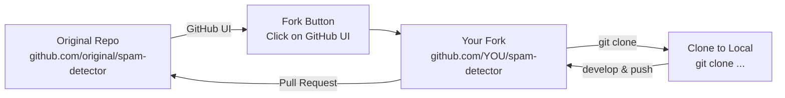
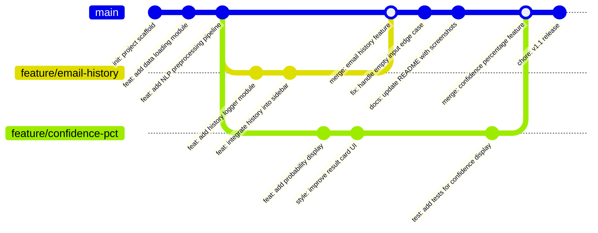
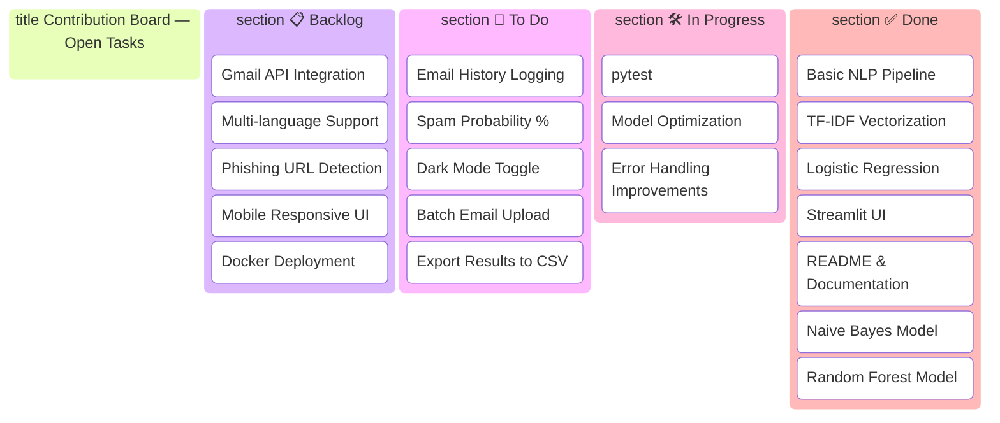

# 📖 Usage Guide
## Spam Email Detector — Setup, Usage & Contribution

> **Document Version:** 1.0  
> **Date:** 2026-06-25  
> **Status:** Draft  
> **Author:** Project Team

---

## 📑 Table of Contents

1. [Prerequisites](#1-prerequisites)
2. [How to Fork the Repository](#2-how-to-fork-the-repository)
3. [How to Clone & Set Up Locally](#3-how-to-clone--set-up-locally)
4. [How to Use the App Step-by-Step](#4-how-to-use-the-app-step-by-step)
5. [How to Run the Mini Project](#5-how-to-run-the-mini-project)
6. [How to Train Your Own Model](#6-how-to-train-your-own-model)
7. [How to Contribute](#7-how-to-contribute)
8. [Git Workflow — Git Graph](#8-git-workflow--git-graph)
9. [Contribution Kanban](#9-contribution-kanban)
10. [Development Workflow Flowchart](#10-development-workflow-flowchart)
11. [Project File Tree](#11-project-file-tree)
12. [Troubleshooting](#12-troubleshooting)
13. [Project Ideas for Contribution](#13-project-ideas-for-contribution)

---

## 1. Prerequisites

Before you begin, ensure you have the following installed:

| Requirement | Version | Install Guide |
|-------------|---------|---------------|
| **Python** | 3.10 or higher | [python.org/downloads](https://python.org/downloads) |
| **Git** | 2.30+ | [git-scm.com](https://git-scm.com/downloads) |
| **pip** | Latest | Included with Python |
| **A code editor** | Any | VS Code recommended |
| **Web browser** | Modern | Chrome, Firefox, Edge, Safari |

### Quick Check

```bash
# Check Python version
python --version
# Expected: Python 3.10.x or higher

# Check pip
pip --version
# Expected: pip 2x.x

# Check Git
git --version
# Expected: git version 2.30.x or higher
```

---

## 2. How to Fork the Repository

### Step 1: Go to the Repository

Visit the GitHub repository: `https://github.com/yourusername/spam-detector`

### Step 2: Click Fork

Click the **Fork** button in the top-right corner of the repository page.

### Step 3: Wait for Fork

GitHub will create a copy of the repository in your account at:
`https://github.com/YOUR_USERNAME/spam-detector`

### Fork Flow Diagram



---

## 3. How to Clone & Set Up Locally

### Step 1: Clone Your Fork

```bash
# Clone YOUR fork (not the original)
git clone https://github.com/YOUR_USERNAME/spam-detector.git

# Navigate into the project directory
cd spam-detector
```

### Step 2: Add the Original as Upstream

```bash
# This allows you to pull updates from the original repo
git remote add upstream https://github.com/original/spam-detector.git

# Verify remotes
git remote -v
# origin    https://github.com/YOUR_USERNAME/spam-detector.git (fetch)
# origin    https://github.com/YOUR_USERNAME/spam-detector.git (push)
# upstream  https://github.com/original/spam-detector.git (fetch)
# upstream  https://github.com/original/spam-detector.git (push)
```

### Step 3: Create a Virtual Environment

```bash
# Create virtual environment
python -m venv venv

# Activate on Windows
venv\Scripts\activate

# Activate on macOS/Linux
source venv/bin/activate
```

### Step 4: Install Dependencies

```bash
# Install all required packages
pip install -r requirements.txt
```

### Step 5: Download NLTK Data

```bash
# Download required NLTK corpora (stopwords, punkt tokenizer)
python -c "import nltk; nltk.download('stopwords'); nltk.download('punkt'); nltk.download('punkt_tab')"
```

### Step 6: Verify Installation

```bash
# Quick verification — should run without errors
python -c "
import pandas as pd
import numpy as np
import nltk
import sklearn
import streamlit
import joblib
print('✅ All packages installed successfully!')
print(f'  Pandas: {pd.__version__}')
print(f'  NumPy: {np.__version__}')
print(f'  NLTK: {nltk.__version__}')
print(f'  Scikit-learn: {sklearn.__version__}')
print(f'  Streamlit: {streamlit.__version__}')
print(f'  Joblib: {joblib.__version__}')
"
```

---

## 4. How to Use the App Step-by-Step

### Step 1: Train the Model (First Time Only)

```bash
# Run the training script
python src/train.py
```

> This will:
> - Load `data/spam.csv`
> - Preprocess all email text
> - Train the Logistic Regression model
> - Save `models/model.pkl` and `models/tfidf.pkl`
> - Print accuracy and evaluation metrics

### Step 2: Launch the Streamlit App

```bash
streamlit run app.py
```

> This opens the app in your browser at `http://localhost:8501`

### Step 3: Test with Sample Emails

**Test 1 — Spam Email:**
```
Congratulations! You have been selected to win ₹1,00,000! Click here NOW to claim your FREE prize. Limited time offer! Don't miss out! URGENT!
```
> Expected: 🚨 **SPAM DETECTED** — Confidence: ~95%+

**Test 2 — Ham Email:**
```
Hi team, just a reminder about our project meeting scheduled at 4 PM today in Conference Room B. Please bring your weekly reports. Thanks.
```
> Expected: ✅ **LEGITIMATE EMAIL** — Confidence: ~98%+

**Test 3 — Edge Case:**
```
Dear customer, your order #12345 has been shipped and will arrive by Friday. Track your package using the link below.
```
> Expected: ✅ **LEGITIMATE EMAIL** — This looks like a real transactional email

### Step 4: Check the Result

- 🚨 **Red (Spam):** The email was classified as spam with a confidence percentage
- ✅ **Green (Ham):** The email was classified as legitimate with a confidence percentage
- The sidebar shows classification history (if enabled)

### App Usage Flow

```mermaid
flowchart TD
    Open[🌐 Open<br/>localhost:8501] --> See[👀 See the<br/>Spam Detector UI]
    See --> Paste[📋 Paste email<br/>in text area]
    Paste --> Click[🖱️ Click<br/>'Check Email']
    Click --> Spinner[⏳ Wait<br/>< 1 second]
    Spinner --> Result{Result?}
    Result|🚨 Spam| Red[🔴 Red Alert<br/>Spam Detected<br/>Confidence: 95%]
    Result|✅ Ham| Green[🟢 Green Success<br/>Legitimate Email<br/>Confidence: 98%]
    Red --> TryAgain[🔄 Try another<br/>email]
    Green --> TryAgain
    TryAgain --> Paste
```

---

## 5. How to Run the Mini Project

### Complete End-to-End Run (from scratch)

```bash
# === STEP 1: Setup ===
git clone https://github.com/YOUR_USERNAME/spam-detector.git
cd spam-detector
python -m venv venv

# Windows
venv\Scripts\activate
# macOS/Linux
# source venv/bin/activate

pip install -r requirements.txt
python -c "import nltk; nltk.download('stopwords'); nltk.download('punkt'); nltk.download('punkt_tab')"

# === STEP 2: Train ===
python src/train.py

# === STEP 3: Run ===
streamlit run app.py

# === STEP 4: Open browser ===
# Go to http://localhost:8501
# Paste an email and click "Check Email"
```

### Run in Jupyter Notebook (for exploration)

```bash
# Install Jupyter
pip install jupyter

# Open the notebooks
jupyter notebook notebooks/
```

The notebooks contain:
| Notebook | Purpose |
|----------|---------|
| `01_eda.ipynb` | Data exploration, visualizations, statistics |
| `02_training.ipynb` | Train and compare multiple ML models |
| `03_evaluation.ipynb` | Confusion matrix, ROC curves, error analysis |

---

## 6. How to Train Your Own Model

### Option A: Use the Training Script

```bash
# Default: Logistic Regression
python src/train.py

# Specify a different model
python src/train.py --model naive_bayes
python src/train.py --model random_forest

# Specify custom dataset
python src/train.py --data path/to/my_dataset.csv

# Custom split ratio
python src/train.py --test-size 0.2
```

### Option B: Train in Notebook

Open `notebooks/02_training.ipynb` and run the cells step by step.

### Option C: Custom Training Script

```python
import pandas as pd
from src.preprocess import TextPreprocessor
from sklearn.feature_extraction.text import TfidfVectorizer
from sklearn.model_selection import train_test_split
from sklearn.linear_model import LogisticRegression
from sklearn.metrics import accuracy_score, classification_report
import joblib

# 1. Load data
df = pd.read_csv("data/spam.csv")
X = df['text']
y = df['label']

# 2. Preprocess
preprocessor = TextPreprocessor()
X_clean = X.apply(preprocessor.preprocess)

# 3. Split
X_train, X_test, y_train, y_test = train_test_split(X_clean, y, test_size=0.2, random_state=42)

# 4. Vectorize
tfidf = TfidfVectorizer(max_features=5000)
X_train_vec = tfidf.fit_transform(X_train)
X_test_vec = tfidf.transform(X_test)

# 5. Train
model = LogisticRegression(max_iter=1000)
model.fit(X_train_vec, y_train)

# 6. Evaluate
y_pred = model.predict(X_test_vec)
print("Accuracy:", accuracy_score(y_test, y_pred))
print(classification_report(y_test, y_pred))

# 7. Save
joblib.dump(model, "models/model.pkl")
joblib.dump(tfidf, "models/tfidf.pkl")
print("✅ Model saved!")
```

---

## 7. How to Contribute

### Contribution Guidelines

We welcome contributions from everyone! Follow these steps:

### Step 1: Fork & Clone

See [Section 2](#2-how-to-fork-the-repository) and [Section 3](#3-how-to-clone--set-up-locally).

### Step 2: Create a Branch

```bash
# Always create a feature branch — NEVER work on main
git checkout -b feature/your-feature-name

# Good branch name examples:
# feature/email-history
# feature/confidence-percentage
# fix/nltk-download-error
# docs/update-readme
```

### Step 3: Make Your Changes

- Write clean, well-commented code
- Follow existing code style (PEP 8)
- Add tests for new features
- Update documentation if needed

### Step 4: Test Your Changes

```bash
# Run tests
pytest tests/

# Run the app to verify
streamlit run app.py

# Check code style
flake8 src/
black --check src/
```

### Step 5: Commit & Push

```bash
# Stage your changes
git add .

# Write a good commit message
git commit -m "feat: add email history logging to sidebar"

# Push to YOUR fork
git push origin feature/your-feature-name
```

### Commit Message Convention

| Prefix | Purpose | Example |
|--------|---------|---------|
| `feat:` | New feature | `feat: add confidence percentage display` |
| `fix:` | Bug fix | `fix: resolve NLTK download error on Windows` |
| `docs:` | Documentation | `docs: update TRD with new class diagram` |
| `style:` | Code formatting | `style: apply black formatting` |
| `refactor:` | Code refactoring | `refactor: extract NLP pipeline to separate module` |
| `test:` | Adding tests | `test: add unit tests for preprocess module` |
| `chore:` | Maintenance | `chore: update requirements.txt versions` |

### Step 6: Create a Pull Request

1. Go to your fork on GitHub
2. Click **"Compare & pull request"**
3. Write a clear description of your changes
4. Link any related issues
5. Submit and wait for review

### Pull Request Template

```markdown
## Description
[Describe what this PR does]

## Type of Change
- [ ] Bug fix
- [ ] New feature
- [ ] Documentation update
- [ ] Refactoring

## Testing
[Describe how you tested your changes]

## Screenshots
[If applicable, add screenshots]

## Checklist
- [ ] Code follows project style
- [ ] Tests added/updated
- [ ] Documentation updated
- [ ] No breaking changes
```

---

## 8. Git Workflow — Git Graph

### Standard Git Flow



### Branch Strategy

| Branch | Purpose | Protected? |
|--------|---------|:---:|
| `main` | Production-ready code | ✅ Yes |
| `develop` | Integration branch | ✅ Yes |
| `feature/*` | New features | ❌ No |
| `fix/*` | Bug fixes | ❌ No |
| `docs/*` | Documentation changes | ❌ No |

---

## 9. Contribution Kanban



---

## 10. Development Workflow Flowchart

```mermaid
flowchart TD
    Start([🟢 Start Contributing])

    Fork[Fork the Repository]
    Clone[Clone to Local Machine]
    Setup[Setup venv + Install Dependencies]
    Branch[Create Feature Branch<br/>git checkout -b feature/xxx]

    Code[Write Code]
    Test[Run Tests<br/>pytest tests/]
    Style[Check Code Style<br/>flake8 + black]
    Verify[Verify App Works<br/>streamlit run app.py]

    TestOK{Tests Pass?}
    TestOK|No| Code
    TestOK|Yes| Commit[Commit Changes<br/>git commit -m 'feat: ...']
    Push[Push to Fork<br/>git push origin feature/xxx]

    Sync{Upstream has<br/>updates?}
    Sync|Yes| Rebase[Rebase on main<br/>git rebase main]
    Rebase --> Push
    Sync|No| PR[Create Pull Request]
    Push --> PR

    Review[Code Review]
    ReviewOK{Approved?}
    ReviewOK|Request Changes| Code
    ReviewOK|Approved| Merge[Merge to Main]
    Merge --> Cleanup[Delete Feature Branch]
    Cleanup --> End([🎉 Contribution Complete])

    Start --> Fork --> Clone --> Setup --> Branch
    Code --> Test --> Style --> Verify

    style Start fill:#4CAF50,color:#fff
    style End fill:#4CAF50,color:#fff
    style PR fill:#2196F3,color:#fff
    style Merge fill:#FF9800,color:#fff
```

---

## 11. Project File Tree

### Full Directory Structure

```mermaid
tree
  root[spam-detector/]
    data["📂 data/"]
    data__spam_csv["📄 spam.csv"]
    data__raw["📂 raw/"]
    models["📂 models/"]
    models__model_pkl["📦 model.pkl"]
    models__tfidf_pkl["📦 tfidf.pkl"]
    notebooks["📂 notebooks/"]
    notebooks__eda["📓 01_eda.ipynb"]
    notebooks__training["📓 02_training.ipynb"]
    notebooks__eval["📓 03_evaluation.ipynb"]
    src["📂 src/"]
    src__init["📄 __init__.py"]
    src__preprocess["🐍 preprocess.py"]
    src__train["🐍 train.py"]
    src__predict["🐍 predict.py"]
    src__model_mgr["🐍 model_manager.py"]
    src__history["🐍 history.py"]
    tests["📂 tests/"]
    tests__test_preprocess["🐍 test_preprocess.py"]
    tests__test_train["🐍 test_train.py"]
    tests__test_model["🐍 test_model_manager.py"]
    docs["📂 docs/"]
    docs__images["📂 images/"]
    app["🐍 app.py"]
    req["📄 requirements.txt"]
    readme["📄 README.md"]
    prd["📄 PRD.md"]
    trd["📄 TRD.md"]
    ai_workflow["📄 AI_WORKFLOW.md"]
    usage["📄 USAGE.md"]
    gitignore["📄 .gitignore"]
    license["📄 LICENSE"]
```

### Text-Based Tree

```
spam-detector/
│
├── 📂 data/                          # Dataset files
│   ├── spam.csv                      # Primary labeled dataset
│   └── 📂 raw/                       # Raw downloaded corpora
│       ├── spam_assassin.csv
│       └── enron.csv
│
├── 📂 models/                        # Serialized models
│   ├── model.pkl                     # Trained ML classifier
│   └── tfidf.pkl                     # Trained TF-IDF vectorizer
│
├── 📂 notebooks/                     # Jupyter notebooks
│   ├── 01_eda.ipynb                  # Exploratory data analysis
│   ├── 02_training.ipynb             # Model training experiments
│   └── 03_evaluation.ipynb          # Evaluation & comparison
│
├── 📂 src/                           # Source code modules
│   ├── __init__.py                   # Package init
│   ├── preprocess.py                 # NLP text preprocessing
│   ├── train.py                      # Model training script
│   ├── predict.py                    # Prediction utilities
│   ├── model_manager.py              # Model load/save helpers
│   └── history.py                    # Email history logger
│
├── 📂 tests/                         # Unit & integration tests
│   ├── test_preprocess.py            # Tests for NLP pipeline
│   ├── test_train.py                 # Tests for model training
│   └── test_model_manager.py         # Tests for model persistence
│
├── 📂 docs/                          # Documentation assets
│   └── 📂 images/                    # Screenshots & diagrams
│
├── app.py                            # 🚀 Streamlit web application
├── requirements.txt                  # Python dependencies
├── README.md                         # Project overview & architecture
├── PRD.md                            # Product requirements
├── TRD.md                            # Technical requirements
├── AI_WORKFLOW.md                    # AI/ML pipeline documentation
├── USAGE.md                          # This file — setup & contribution guide
├── .gitignore                        # Git ignore rules
└── LICENSE                           # MIT License
```

---

## 12. Troubleshooting

### Common Issues & Solutions

| Issue | Cause | Solution |
|-------|-------|----------|
| `ModuleNotFoundError: nltk` | Missing dependency | `pip install nltk` |
| `LookupError: stopwords` | NLTK data not downloaded | `python -c "import nltk; nltk.download('stopwords')"` |
| `FileNotFoundError: model.pkl` | Model not trained yet | Run `python src/train.py` first |
| `FileNotFoundError: spam.csv` | Dataset missing | Download dataset to `data/spam.csv` |
| `Port 8501 already in use` | Another Streamlit running | Kill process: `lsof -ti:8501 \| xargs kill` |
| `Streamlit not found` | Not installed / venv not active | Activate venv, then `pip install streamlit` |
| `UnicodeDecodeError` | CSV encoding issue | Use `pd.read_csv('spam.csv', encoding='latin-1')` |
| `Low accuracy (< 90%)` | Bad dataset or preprocessing | Check data quality, verify preprocessing steps |
| `MemoryError` | Very large dataset | Reduce `max_features` in TF-IDF or use batches |
| `Venv activation fails (Windows)` | Execution policy | Run: `Set-ExecutionPolicy -Scope CurrentUser RemoteSigned` |

### Get Help

- 📖 Check [README.md](./README.md) for overview
- 📋 Check [TRD.md](./TRD.md) for technical details
- 🤖 Check [AI_WORKFLOW.md](./AI_WORKFLOW.md) for ML pipeline info
- 🐛 Open a [GitHub Issue](https://github.com/yourusername/spam-detector/issues)

---

## 13. Project Ideas for Contribution

### Beginner-Friendly 🟢

| Idea | Description | Files to Modify |
|------|-------------|----------------|
| Add more sample emails | Expand test examples in README | `README.md` |
| Improve error messages | Make validation errors user-friendly | `app.py` |
| Add input character counter | Show character count in text area | `app.py` |
| Add dark mode toggle | Theme switcher in sidebar | `app.py` |

### Intermediate 🟡

| Idea | Description | Files to Modify |
|------|-------------|----------------|
| Email history logging | Save and display past classifications | `src/history.py`, `app.py` |
| Confidence bar chart | Visual probability bar | `app.py` |
| Batch email upload | Upload CSV of emails | `app.py`, `src/predict.py` |
| Export results to CSV | Download classification results | `app.py` |
| Model selector dropdown | Switch between LR, NB, RF | `app.py`, `src/train.py` |

### Advanced 🔴

| Idea | Description | Files to Modify |
|------|-------------|----------------|
| Phishing URL detection | Detect and flag phishing links | New: `src/phishing.py` |
| Gmail API integration | Read emails directly from Gmail | New: `src/gmail_client.py` |
| Multi-language support | Detect and process non-English emails | `src/preprocess.py` |
| Docker containerization | Create Dockerfile for deployment | New: `Dockerfile` |
| REST API wrapper | Add FastAPI endpoints | New: `api.py` |
| HuggingFace deployment | Deploy to HF Spaces | New: `Dockerfile`, `.streamlit/` |

---

<p align="center">
  <strong>Happy Coding! 🎉</strong><br>
  <em>Thank you for contributing to the Spam Email Detector project!</em>
</p>

<p align="center">
  <strong>USAGE.md v1.0</strong> — Last updated: June 25, 2026
</p>
